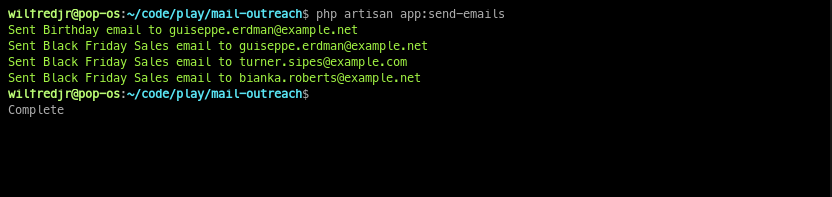

# Mail Outreach
[](#)
[](https://opensource.org/licenses/MIT)

Mail Outreach is a tool designed to automate the scheduling and sending of emails for events like special-days and holidays.

## Installation and usage
>Ensure your system meets the [Laravel 11 requirenments](https://laravel.com/docs/11.x/releases)

## Installation
### 1. Clone this Repository
```shell
https://github.com/Joshuawilfred/mail-outreach.git
```
### 2. Install Dependencies
```shell
cd mail-outreach
```
```shell
composer install
npm install
npm run dev
```
### 3. Configure Environment
```shell
cp .env.example .env
```
Update the `.env` file with your environment variables, especially mailer settings.

### 4. Database Setup
```shell
php artisan migrate --seed
```
### 5. Start Application Server
```shell
php artisan serve 
```
Open new terminal and start npm server
```shell
npm run dev
```
## Usage

### 1. Add New Entries
Add new `Clients` then `Holidays` entries and set the date to the nearest date and time to test the email functionality.

### 2. Run the Scheduled Commands Manually
```shell
php artisan schedule:run
```
Alternatively you can run the custom send emails command directly 
```shell
php artisan app:send-emails
```

### 3. Testing Emails
After Sending emails, you can see them on `storage/logs/laravel.log` <br>
**Tip:** Configure Email Delivery service like [Mailtrap](https://mailtrap.io/) to your `MAILER` .env To be able to send real time emails and see email views

### 4. Cron Job
It is advised to create a cron job to run the `schedule:run` command regularly to ensure that emails are sent on time.

## Important Files & Folders
- `app/Console/Commands/SendEmails.php`
- `app/Console/Commands/ResetAnnualEmailStatuses.php`
- `app/Mail`
- `resources/views/emails`
- `routes/console.php`

## Running Commands
> ### Custom commands
>> - `php artisan app:send-emails`
>> - `php artisan app:reset-email-statuses`
> ##
> ### Scheduled commands
>> - `php artisan schedule:run`
>> - `php artisan schedule:list`
> ##

## License

This tool is licensed under the [MIT license](https://opensource.org/licenses/MIT). Contributions are welcomed!
